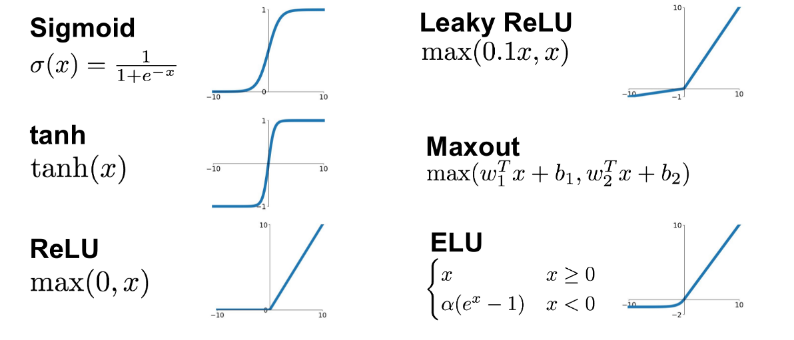

# Activation Functions

## Sigmoid

$$
\sigma(x) = \frac{1}{1 + e^{-x}}
$$

## Tanh

$$
\tanh(x) = \frac{e^x - e^{-x}}{e^x + e^{-x}}
$$

## ReLU

$$
\text{ReLU}(x) = \max(0, x)
$$

## Leaky ReLU

$$
\text{LeakyReLU}(x) = \max(0.01x, x)
$$

## Softmax

$$
\text{Softmax}(x_i) = \frac{e^{x_i}}{\sum_{j=1}^n e^{x_j}}
$$

## ELU

$$
\text{ELU}(x) = \begin{cases}
x & \text{if } x \geq 0 \\
\alpha (e^x - 1) & \text{if } x < 0
\end{cases}
$$

## Maxout

$$
\text{Maxout}(x) = \max(w_1^T x + b_1, w_2^T x + b_2)
$$
